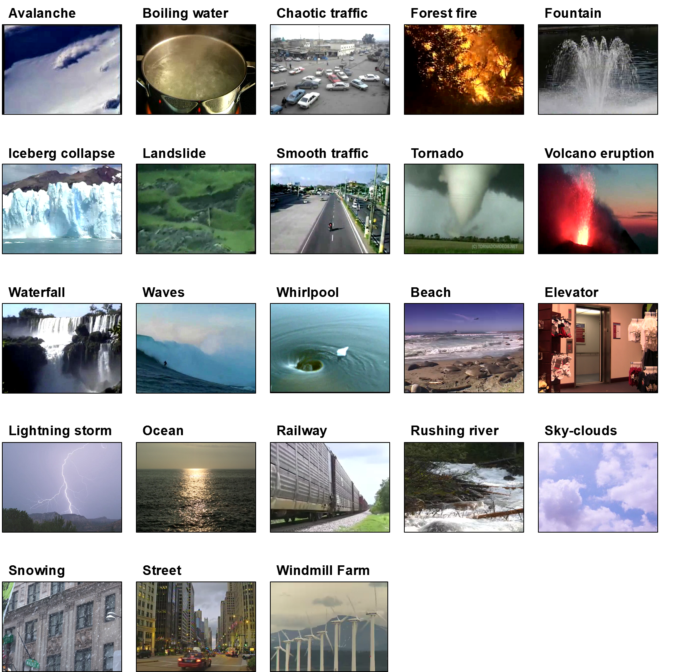

# Maryland-Yupenn

Description
------------
While static scene datasets have been extensively introduced, only two public datasets exist for dynamic scenes. To address this short coming, we construct a dataset that includes 23 dynamic scene classes with 10 videos per class by combining the Maryland and Yupenn datasets. 

Because the number of sequences in each class differs between Maryland (10) and Yupenn (14), we select 10 random sequences from each class in both datasets. 

For those classes that exist in both datasets, such as "Forest Fire," "Fountain," and "Waterfall", five random sequences are extracted from each dataset, and combined. We additionally incorporate "Smooth Traffc" in Maryland and "Highway" in Yupenn because they have very similar appearances and motion. 

download link: https://goo.gl/bGPnbu

NOTE
------------
If you use the Maryland–Yupenn dataset, please cite these works:
[1] Shroff, Nitesh, Pavan Turaga, and Rama Chellappa. "Moving vistas: Exploiting motion for describing scenes." Computer Vision and Pattern Recognition (CVPR), 2010 IEEE Conference on. IEEE, 2010.
[2] Derpanis, Konstantinos G., et al. "Dynamic scene understanding: The role of orientation features in space and time in scene classification." Computer Vision and Pattern Recognition (CVPR), 2012 IEEE Conference on. IEEE, 2012.
[3] Hong, Sungeun, et al. "Recognizing Dynamic Scenes with Deep Dual Descriptor based on Key Frames and Key Segments." arXiv preprint arXiv:1702.04479 (2017).

Author
------------
Sungeun Hong / @[csehong][wp]
[wp]: sites.google.com/site/csehong

